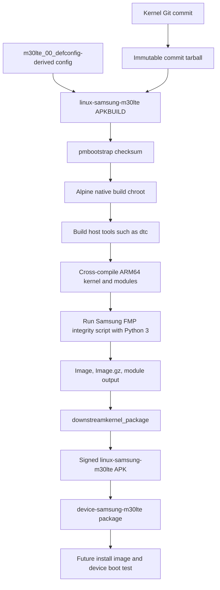

# postmarketOS downstream port for Samsung Galaxy M30 (m30lte)

This document records the first reproducible postmarketOS kernel package build
for the Samsung Galaxy M30 (`m30lte`) from this repository. It covers the build
only; it does not claim that the phone has booted or that hardware support is
complete.

## Build status

Verified on 2026-06-21 with pmbootstrap 3.10.1 on WSL/Ubuntu:

- Channel: `edge`
- Device: `samsung-m30lte`
- Architecture: `aarch64`
- UI: `console`
- Init system: OpenRC (systemd disabled)
- Flash method: `heimdall`
- Boot type: `bootimg`
- Kernel: `4.4.177`
- Kernel commit: `720f3efceb46b22df4becbe8a83ee0c2bbe71d3a`
- Result: `linux-samsung-m30lte-4.4.177-r0.apk`
- Device package: `device-samsung-m30lte` also builds successfully

## Build flow



## Fixes required for the package build

### 1. Duplicate `yylloc` symbol in DTC

Modern host compilers default to `-fno-common`. The shipped DTC lexer and parser
both defined `yylloc`, causing the host linker to fail with:

```text
multiple definition of `yylloc'
```

The lexer must declare the parser-owned symbol instead of defining another one.
Both the Flex source and its checked-in generated file now use:

```c
extern YYLTYPE yylloc;
```

This fix is in commit `8d563464e57a3c39b9d1dd0f78c2a82b41c53642`.

A second issue initially hid this fix: GitHub's mutable `master.tar.gz` archive
was cached and still contained `YYLTYPE yylloc;`. The package therefore uses an
immutable commit archive and a commit-specific `builddir`, never a branch
archive.

### 2. Connectivity gadget ioctl constants hidden from kernel builds

`f_conn_gadget.c` always uses constants from `f_conn_gadget.ioctl.h`, but that
header exposed them only for Android or Tizen userspace compilation. The
postmarketOS kernel compiler defines `__KERNEL__`, not `__ANDROID__`, so the
driver failed with undeclared `CONN_GADGET_IOCTL_*` constants.

The private header guard now includes kernel compilation:

```c
#if defined(__KERNEL__) || defined(__ANDROID__) || defined(__TIZEN__)
```

This fix is in commit `720f3efceb46b22df4becbe8a83ee0c2bbe71d3a`.

### 3. Python missing for Samsung FMP integrity generation

With `CONFIG_EXYNOS_FMP_FIPS` enabled, `scripts/link-vmlinux.sh` executes
`scripts/fmp/fips_fmp_integrity.py` after linking `vmlinux`. The package must
therefore include `python3` in `makedepends`. Without it, the build reaches the
final link and fails with `env: can't execute 'python3'`.

## Required kernel APKBUILD details

Keep these values in the local pmaports package:

```sh
maintainer="Shlok Soni <22mca062@nirmauni.ac.in>"
pkgname=linux-samsung-m30lte
pkgver=4.4.177
pkgrel=0
arch="aarch64"
_carch="arm64"
_flavor="samsung-m30lte"

_repository="android_kernel_samsung_m30lte"
_commit="720f3efceb46b22df4becbe8a83ee0c2bbe71d3a"
_config="config-$_flavor.$arch"
source="
        $pkgname-$_commit.tar.gz::https://github.com/Shloksoni22122001/$_repository/archive/$_commit.tar.gz
        $_config
"
builddir="$srcdir/$_repository-$_commit"
```

The `makedepends` list must contain at least:

```text
bash bc bison devicepkg-dev findutils flex openssl-dev perl python3
```

At the verified commit, the kernel archive checksum is:

```text
38118d1d90210ba2ff11c8eb0b00acaac9bf6aa8e5a8e4fab7deb940394e671dad9c9c0cc48c02c50f80cca32524c08724da3817e9c437ffc2ba212547b4e8ae
```

Always regenerate checksums after changing `_commit` rather than copying this
value blindly.

## Rebuild commands

```sh
pmbootstrap checksum linux-samsung-m30lte
pmbootstrap build --lax linux-samsung-m30lte
pmbootstrap checksum device-samsung-m30lte
pmbootstrap build --lax device-samsung-m30lte
```

The verified kernel package was written to:

```text
~/.local/var/pmbootstrap/packages/edge/aarch64/linux-samsung-m30lte-4.4.177-r0.apk
```

## Warnings seen during the successful build

The vendor 4.4 tree emits many warnings with GCC 15, including packed-member,
array-bounds, string-operation, executable-segment, and one modpost section
mismatch warning. They did not stop this build, but they should not be confused
with proof of runtime correctness. The build also reports the missing optional
`firmware/tsp_zinitix` directory.

## Next validation stage

The next milestone is a boot test, not more compile-time patching:

1. Create an install image with `pmbootstrap install`.
